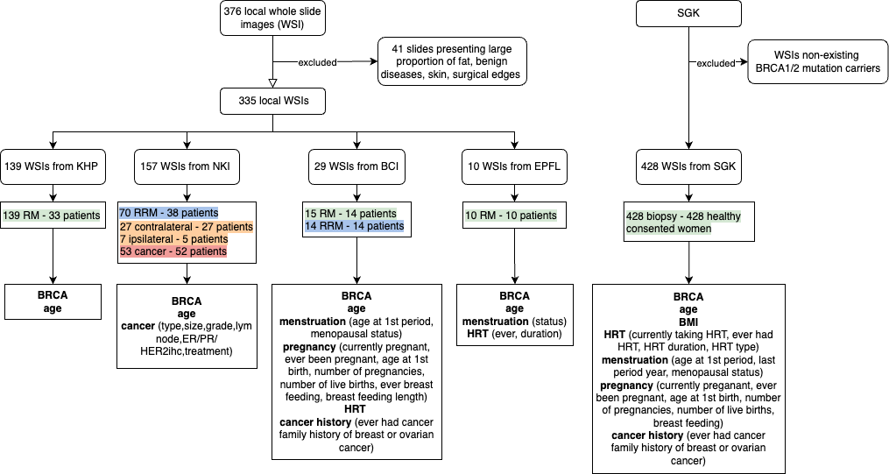
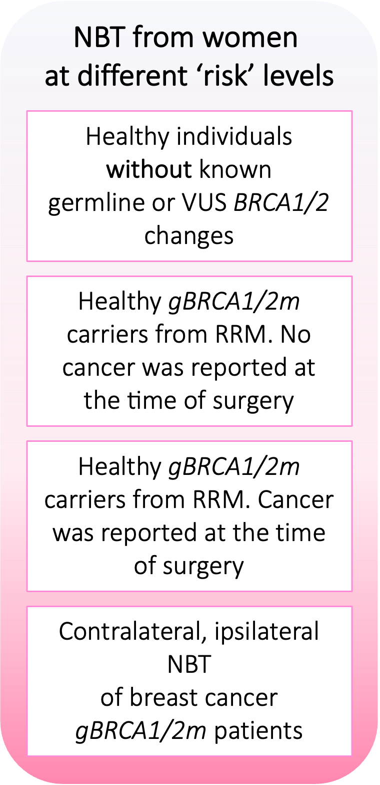

# **OASIS** n**O**rmal bre**A**St t**IS**sue
This repo contains all documentation about the **OASIS** dataset containing whole slide images of normal breast tissue from multiple cohorts hosted on XXX

- Dataset size: XTB
- Contact name: Mario Parreno-Centeno
- Institution name: Kings's College London
- Institution URL: http://cancerbioinformatics.co.uk/
- Download at XXX: 
- Contact email: mario.parreno-centeno@kcl.ac.uk


## **Description of WSIs**
This is a retrospective dataset of 376 H&E-stained whole slide image (WSI) of normal breast tissue. The images were collected from 4 institutions, namely **the King’s Health Partners Cancer Biobank (KHP)**, **the Netherlands Cancer Institute (NKI)**, **the Barts Cancer Institute (BCI)**, **the Cathrin Brisken Lab at the École Polytechnique Fédérale de Lausanne (EPFL)**. In the paper, we also analysed 428 WSIs from the public **Susan G. Komen Tissue Bank (SGK)**.





- For all WSIs received from the above 4 institutions, 41 slides were excluded due to low image quality issue.
- The **KHP** cohort consisted of 139 WSIs from 139 patients undergone reduction mammoplasty (RM)(with no known BRCA1/2 mutation). Additional clinical data including patient age is available for these patients.
- The **NKI** cohort consisted of 157 WSIs, including 70 WSIs from 38 patients undergone risk-reducing mastectomy (RRM), 27 WSIs from contralateral normal breast tissue from 27 breast cancer patients, 7 WSIs from ipsilateral normal breast tissue from 5 breast cancer patients, and 53 WSIs presenting peri-tumoral normal breast tissue from 52 breast cancer patients. Clinical data including BRCA mutation status, patient age, and cancer history are available for these patients.
- The **BCI** cohort consisted of 29 WSIs, including 15 WSIs from 14 patients undergone RM (BRCA1/2 mutation not known), 14 WSIs from 14 patients undergone RRM (BRCA1/2 mutation carriers). Additional clinical data including patient age, menstruation, pregnancy, HRT use, and cancer history are available for these patients.
- The **EPFL** cohort consisted of 10 WSIs from 10 patients undergone RM (BRCA1/2 mutation not known). Clinical data including patient age, menstruation, and HRT use are available for these patients.


## **Manual Annotation**
Tissue type annotations are available for 70 WSIs, including 16 from NKI, 16 from BCI, 16 from KHP, 10 from EPFL and 12 from SGK. Lobule type annotations are available for 16 KHP WSIs. Annotations files and screenshots are stored in the tissue_type_annotation and lobule_type_annotation folders. The .geojson files could be directly imported into QuPath.


## Example usage
Below code demonstrates how to load WSIs programmatically using Python Openslide package
 
 ```python
import openslide
import numpy as np
import matplotlib.pyplot as plt

#Read WSI
wsi = openslide.OpenSlide("/Path/to/wsi.ndpi")

#Get slide properties
dims=wsi.dimensions
x_resolution=wsi.properties[openslide.PROPERTY_NAME_MPP_X]
y_resolution=wsi.properties[openslide.PROPERTY_NAME_MPP_X]
base_mag=wsi.properties[openslide.PROPERTY_NAME_OBJECTIVE_POWER]

#Display thumbnail
wsi_thumbnail = wsi.get_thumbnail((1000,1000))
wsi_thumbnail=np.array(wsi_thumbnail)
plt.imshow(wsi_thumbnail)
plt.axis('off')
```




## Credits

If you find the data useful, please cite the below paper:

    @inproceedings{,
        title={},
        booktitle={},
        author={},
        year={}
    }


